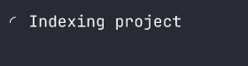
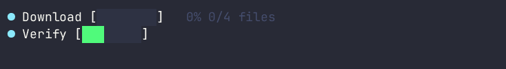
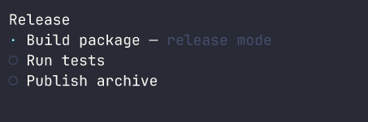
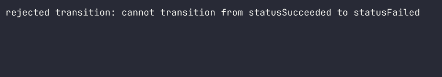
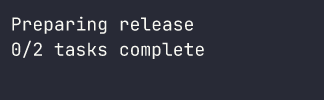

# TerminalStatus

[](https://github.com/titanomachy/terminal-status/actions/workflows/ci.yml)

`terminal_status` is a pure-Nim library under active development for terminal
spinners, single and multi-progress bars, and ordered task step-trackers. Its
component renderers are deterministic, terminal-cell aware, and ANSI-safe;
the explicit live layer can redraw an ANSI terminal or coalesce redirected
output without starting a thread or owning terminal input state.

## Platform support

TerminalStatus targets Linux, macOS, and Windows. GitHub Actions runs the full
test suite on all three operating systems with Nim 2.0.0, Nim 2.2.x, and the
latest stable compiler. Live ANSI behavior depends on the capabilities of the
borrowed terminal; redirected files and pipes use deterministic plain output.

## Requirements

- Nim 2.0.0 or newer
- [`terminal_style`](https://github.com/titanomachy/terminal-style) 0.1.1 or newer
- [`terminal_screen`](https://github.com/titanomachy/terminal-screen) 0.1.1 or newer
- No runtime dependencies beyond `terminal_style` and `terminal_screen`

## TerminalDeck

TerminalStatus is the status and progress component library in TerminalDeck,
a set of focused Nim terminal packages that compose through ordinary strings
and shared terminal-width and styling rules:

```text
TerminalDeck
├── Foundations
│   ├── TerminalStyle
│   └── TerminalScreen
├── Output components
│   ├── TerminalStatus  ← this package
│   ├── TerminalLayout
│   ├── TerminalTable
│   └── TerminalGraph
└── Interaction
    ├── TerminalPrompt
    └── TerminalWidgets
```

This diagram describes the suite, not the dependency graph. TerminalStatus
depends only on TerminalStyle and TerminalScreen; the other packages can
consume its rendered strings without adapters or reverse dependencies.

## Table of contents

- [Platform support](#platform-support)
- [Requirements](#requirements)
- [TerminalDeck](#terminaldeck)
- [Table of contents](#table-of-contents)
- [Installation](#installation)
- [Quick start](#quick-start)
- [API overview](#api-overview)
  - [Themes and character presets](#themes-and-character-presets)
  - [Spinner](#spinner)
  - [Progress](#progress)
  - [Multi-progress](#multi-progress)
  - [Steps](#steps)
  - [Shared contracts](#shared-contracts)
  - [Live output strategies](#live-output-strategies)
- [Focused modules](#focused-modules)
- [Suite interoperability](#suite-interoperability)
- [Examples](#examples)
- [Development and documentation](#development-and-documentation)
- [Attribution and license](#attribution-and-license)

## Installation

Install the current package and its dependencies with Nimble:

```sh
nimble install terminal_status
```

Or install directly from GitHub:

```sh
nimble install https://github.com/titanomachy/terminal-style
nimble install https://github.com/titanomachy/terminal-screen
nimble install https://github.com/titanomachy/terminal-status
```

You can also add TerminalStatus to your application's Nimble file:

```nim
requires "terminal_status >= 0.1.0"
```

Nimble resolves TerminalStyle and TerminalScreen transitively. TerminalLayout,
TerminalTable, TerminalGraph, TerminalPrompt, and TerminalWidgets are not
runtime dependencies; they may consume rendered status strings at the ordinary
string boundary.

Then import the complete public API:

```nim
import terminal_status
```

## Quick start


[Download the source asciicast](docs/recordings/renderers.cast) or run the
finite [`examples/renderers.nim`](examples/renderers.nim) dashboard locally.

```sh
nim r --path:src examples/renderers.nim --once
```

All components expose the same side-effect-free `render` shape. Pass one
monotonic timestamp so every animation and metric in a multi-row frame agrees:

```nim
import std/[monotimes, times]
import terminal_status

let started = getMonoTime()
var download = initProgressBar("Download", 100, "MB", started)
download.advance(50, started + initDuration(seconds = 2))

var options = defaultRenderOptions()
options.characters = statusAscii
options.useColor = false
options.barWidth = 10

doAssert download.render(
  options,
  started + initDuration(seconds = 2)
) == "> Download [#####-----]  50% 50/100 MB 25.0 MB/s ETA 2s"
```

`render` is overloaded for `Spinner`, `ProgressBar`, `MultiProgress`, and
`StepTracker`. A positive `width` is a maximum measured in terminal cells;
rows are never padded, wide or combined graphemes are not split, and narrow
progress rows shed elapsed, rate, ETA, and count metadata before shrinking the
bar or label. Multi-row output has no trailing newline.

Caller text is normalized to one safe row. SGR styles and OSC-8 hyperlinks are
preserved and closed when color is enabled; terminal movement, erasure, title,
clipboard, and other executable controls are removed. `useColor = false`
removes both theme and caller ANSI. See the [pure rendering guide](docs/rendering.md)
for metric formats, responsive reduction, and safety details.

## API overview

| Component | Main API | Purpose |
| --- | --- | --- |
| [Themes and character presets](#themes-and-character-presets) | `StatusTheme`, `StatusCharacters`, `RenderOptions` | Explicit color, marker, character, width, and metadata choices |
| [Spinner](#spinner) | `Spinner`, `SpinnerStyle`, `initSpinner`, `render` | Time-derived activity frames and terminal outcomes |
| [Progress](#progress) | `ProgressBar`, `initProgressBar`, `initIndeterminateProgressBar` | Validated determinate metrics and indeterminate pulse rendering |
| [Multi-progress](#multi-progress) | `MultiProgress`, `TaskId` | Insertion-ordered tasks with stable, non-reused IDs |
| [Steps](#steps) | `StepTracker`, `StepSnapshot` | Ordered workflows with success, failure, and cancellation |
| [Shared contracts](#shared-contracts) | `StatusState`, errors, snapshots, validation helpers | Common lifecycle, identity, ownership, and timing rules |
| [Live output strategies](#live-output-strategies) | `LiveDisplay`, `withLiveDisplay` | Explicit ANSI redraws or coalesced redirected output |

Most applications can import `terminal_status`. Use a
[focused module](#focused-modules) when you want a narrower compile-time or
dependency boundary.

## Themes and character presets

Presentation is local and explicit: `StatusTheme` holds semantic
`TerminalStyle` values, `StatusCharacters` selects Unicode or ASCII glyphs,
and `RenderOptions.useColor` determines whether styling is retained. No global
theme is installed and no terminal is queried when defaults are constructed.


[Download the source asciicast](docs/recordings/themes.cast) or run the finite
[`examples/customization.nim`](examples/customization.nim) demo locally.

```nim
import terminal_style
import terminal_status

var options = defaultRenderOptions()
options.characters = statusAscii
options.useColor = false
options.theme.successStyle = initTerminalStyle(
  foreground = colorMagenta,
  attributes = {taBold}
)

doAssert asciiStatusMarkers().succeeded == "+"
doAssert unicodeStatusMarkers().succeeded == "✓"
```

The default semantic colors are cyan for running work, green for success and
completed bars, red for failures, yellow for cancellation, and dim bright
black for pending or secondary content. The disabled TerminalStyle path strips
both theme styling and caller-provided ANSI, so every renderer guarantees plain
output for `useColor = false`.

See the [themes and marker guide](docs/themes.md) and finite
[`customization.nim`](examples/customization.nim) example for the full marker
table, a custom theme and spinner preset, and `--ascii`/`--no-color` previews.

## Spinner



[Download the source asciicast](docs/recordings/spinner.cast) or run the finite
[`spinner.nim`](examples/spinner.nim) animation locally.

Import the façade, choose a built-in preset, and sample frames whenever your
application refreshes its display:

```nim
import std/[monotimes, strutils, times]
import terminal_status

let started = getMonoTime()
var spinner = initSpinner("Indexing files", arcSpinner(), started)

# Rendering and frame selection are pure; no background timer is started.
let later = started + initDuration(milliseconds = 200)
doAssert spinner.frame(now = later) == "◝"
doAssert spinner.render(now = later).endsWith(" Indexing files")

spinner.setLabel("Index complete")
spinner.succeed(later)
doAssert spinner.state == statusSucceeded
doAssert spinner.elapsed(later).inMilliseconds == 200
```

`dotsSpinner`, `lineSpinner`, `arcSpinner`, and `pulseSpinner` include both
Unicode frames and printable-ASCII fallbacks. Pass `asciiOnly = true` to
`frame` for the fallback. `initSpinnerStyle` validates custom frame widths,
controls, fallback counts, and positive intervals.

Animation is derived from monotonic elapsed time; callers explicitly sample
and refresh it. Terminal transitions freeze elapsed time and frame selection.
Repeating the same success, failure, or cancellation is harmless, while
switching terminal outcomes raises `StatusStateError`. See the
[Spinner model guide](docs/spinners.md) for presets, customization, ownership,
and transition behavior.

## Progress


[Download the source asciicast](docs/recordings/progress.cast) or run the
animated [`progress_bar.nim`](examples/progress_bar.nim) example locally with
`nim r --path:src examples/progress_bar.nim --demo`.

Determinate progress checks every numeric update before mutation and
automatically succeeds when it reaches the exact total:

```nim
import std/[monotimes, options, times]
import terminal_status

let started = getMonoTime()
var download = initProgressBar("Download", 10, "files", started)

download.advance(4, started + initDuration(seconds = 2))
doAssert download.fraction.get == 0.4
doAssert download.ratePerSecond(
  started + initDuration(seconds = 2)).get == 2.0
doAssert download.eta(
  started + initDuration(seconds = 2)).get.inSeconds == 3

download.complete(started + initDuration(seconds = 5))
echo download.render(now = started + initDuration(seconds = 5))
```

Rates are lifetime averages based on monotonic elapsed time. ETA is available
only for running determinate work with a positive rate and is rounded to the
nearest millisecond. Terminal elapsed time and rate freeze at the first finish
timestamp, and terminal ETA is absent.

`initIndeterminateProgressBar` represents work without a total. Its renderer
derives pulse motion from the stored start timestamp, so it needs no
per-frame model mutation. See the [Progress models guide](docs/progress.md) and
the finite [`progress_bar.nim`](examples/progress_bar.nim) and
[`indeterminate_bar.nim`](examples/indeterminate_bar.nim) examples.

## Multi-progress



[Download the source asciicast](docs/recordings/multi-progress.cast) or run the
animated [`multi_progress.nim`](examples/multi_progress.nim) example locally
with `nim r --path:src examples/multi_progress.nim --demo`.

`MultiProgress` keeps insertion order and assigns IDs that are never reused:

```nim
var work = initMultiProgress()
let
  compileId = work.addTask("Compile", 12, "modules")
  uploadId = work.addIndeterminateTask("Upload")

work.advance(compileId, 3)
work.complete(uploadId)
doAssert work.taskIds == @[compileId, uploadId]
echo work.render()
```

All mutations by ID reject unknown tasks without changing the collection.
Snapshot queries return detached values and fresh sequence storage. The finite
[`multi_progress.nim`](examples/multi_progress.nim) example demonstrates task
mutation, removal, and non-reused IDs.

## Steps



[Download the source asciicast](docs/recordings/steps.cast) or run the animated
[`step_tracker.nim`](examples/step_tracker.nim) example locally with
`nim r --path:src examples/step_tracker.nim --demo`.

```nim
var release = initStepTracker(["Build", "Test", "Publish"], "Release")
release.start()
release.setCurrentDetail("release mode")
release.advance()
echo release.render()
```

Advancing succeeds the current step and starts the next; advancing the last
step succeeds the tracker. Failure affects the current step while leaving later
steps pending. Cancellation preserves earlier successful steps. See the
[Step tracker guide](docs/steps.md) and finite
[`step_tracker.nim`](examples/step_tracker.nim) example.

## Shared contracts



[Download the source asciicast](docs/recordings/shared-contracts.cast) or run
the paced [`shared_types.nim`](examples/shared_types.nim) example locally with
`nim r --path:src examples/shared_types.nim --demo`.

Import `terminal_status/types` directly or use the `terminal_status` façade for
the shared API:

```nim
import terminal_status

let taskId = TaskId(42)
doAssert $taskId == "42"
doAssert statusSucceeded.isTerminal
```

The shared module includes lifecycle and progress states, catchable model
errors, task IDs, detached progress/step snapshots, meaningful-text and numeric
validation, finite terminal transitions, and clamped monotonic-duration
helpers. See [Shared contracts](docs/shared-contracts.md) for behavior and
ownership details. The finite [`shared_types.nim`](examples/shared_types.nim)
and [`validation.nim`](examples/validation.nim) examples show those contracts
and their failure handling as runnable programs.

## Live output strategies



[Download the source asciicast](docs/recordings/live-output.cast) or run the
animated [`live_output.nim`](examples/live_output.nim) example locally with
`nim r --path:src examples/live_output.nim --ansi --hide-cursor --demo`.

`LiveDisplay` borrows `stderr` by default. Auto mode performs one TerminalScreen
capability check when the display opens: ANSI-capable output uses redraws, while
a file or pipe uses plain output. Construction and import remain side-effect
free.

```nim
import terminal_status

var options = defaultLiveDisplayOptions() # borrowed stderr
withLiveDisplay display, options:
  display.update("Downloading\n25% complete")
  display.update("Download complete\n100% complete")
```

In ANSI mode a changed frame clears exactly the rows previously owned by the
display before drawing its replacement, so narrower or shorter frames leave no
stale text and unrelated terminal output is not erased. `finishKeep` moves
subsequent output below the retained frame; set `finishPolicy = finishClear` to
erase the region on close. Cursor hiding is opt-in and ownership-aware:
`hideCursor = true` restores visibility exactly once during cleanup.

Redirected output defaults to `plainFinalOnly`, so the example emits only the
latest frame when it closes instead of logging every animation tick. Set
`mode = livePlain` and `plainPolicy = plainEveryChange` to write every changed
visible frame; duplicate frames and color-only changes are suppressed. Plain
output always strips ANSI.

Caller-supplied frames have a deliberately strict boundary: logical rows use
LF only and may contain safe SGR styles or well-formed OSC-8 hyperlinks, but
carriage returns, tabs, terminal movement/erasure, title or clipboard controls,
and malformed escapes raise `ValueError` before output or cached state changes.
Pure renderers already produce valid frames.

Displays are single-use and single-thread owned. They never close the borrowed
stream, enter raw input mode, query terminal geometry, or create a refresh
loop. Updates and close flush only at the configured points, while duplicate
frames perform neither operation. Prefer `withLiveDisplay`, whose `finally`
cleanup covers normal return and catchable Nim exceptions (not signals,
process termination, defects, or `SIGKILL`).

TerminalStatus also composes inside an application-owned TerminalScreen
session without taking over its input lifecycle:

```nim
import terminal_screen
import terminal_status

var sessionOptions = defaultSessionOptions()
sessionOptions.rawMode = false
sessionOptions.hideCursor = false
sessionOptions.requireTerminal = false
sessionOptions.monitorResize = false

withTerminalSession screen, stdin, stdout, sessionOptions:
  var liveOptions = defaultLiveDisplayOptions(stdout)
  withLiveDisplay display, liveOptions:
    display.update("TerminalStatus inside TerminalScreen")
  doAssert screen.isOpen
```

See the
[live output guide](docs/live-output.md) and finite
[`live_status.nim`](examples/live_status.nim) manual-refresh example. The
[`redirected_output.nim`](examples/redirected_output.nim) example isolates the
default final-only behavior, while [`live_output.nim`](examples/live_output.nim)
exposes each output and cleanup strategy as a CLI option. For an application
that already owns terminal state, [`screen_composition.nim`](examples/screen_composition.nim)
shows a `LiveDisplay` inside a non-raw TerminalScreen session; closing the
display leaves that surrounding session open and untouched.

## Focused modules

| Module | Available responsibility |
| --- | --- |
| `terminal_status` | Side-effect-free façade exporting implemented public modules. |
| `terminal_status/types` | Shared states, errors, IDs, snapshots, validation, transitions, and time helpers. |
| `terminal_status/spinners` | Validated presets and pure, time-derived spinner state. |
| `terminal_status/progress` | Determinate/indeterminate progress metrics and ordered multi-progress tasks. |
| `terminal_status/steps` | Ordered step state, details, failure, and cancellation. |
| `terminal_status/themes` | Semantic TerminalStyle values and Unicode/ASCII marker presets. |
| `terminal_status/rendering` | Pure component renderers, metrics, text safety, and responsive cell widths. |
| `terminal_status/live` | Auto/forced ANSI or plain output with coalesced redirected frames. |

TerminalStatus uses TerminalStyle for ANSI-aware validation and terminal-cell
measurement. The live module uses TerminalScreen for deferred capability
detection and cursor commands, but never opens a raw-mode session. Library
model and rendering modules never query or write to a terminal.

Import `terminal_status` when the complete API is convenient. Applications
with a narrower dependency boundary can import focused modules instead:

```nim
import terminal_status/[progress, rendering, themes]

var bar = initProgressBar("Compile", 4, "modules")
bar.advance(3)

var options = defaultRenderOptions()
options.characters = statusAscii
options.useColor = false
echo bar.render(options)
```

Both forms are safe during module initialization. Importing the façade or any
focused module emits and flushes no output, performs no terminal capability or
environment query, starts no timer or thread, and installs no mutable global
status state. Terminal detection occurs only when `open` is explicitly called
on an auto-mode `LiveDisplay`; default constructors and pure renderers do not
open the live layer. The finite [`api_facade.nim`](examples/api_facade.nim)
example compiles in façade mode by default and in focused-import mode with
`-d:focusedImports`.

## Suite interoperability

Every pure renderer returns an ordinary string. Pass that string directly to
a TerminalLayout panel or TerminalTable cell—there is no TerminalStatus
adapter, shared mutable state, or reverse dependency:

```nim
import terminal_layout
import terminal_table
import terminal_status/[progress, rendering]

var bar = initProgressBar("Compile suite", 4)
bar.advance(3)

var options = defaultRenderOptions()
options.width = 32
options.barWidth = 8
options.useColor = false
options.showCount = false
options.showRate = false
options.showEta = false
let status = bar.render(options)

let panel = initPanel(status, width = 36, useColor = false)
var table = initTable(["Current status"])
table.addRow(status)
```

Focused `progress` and `rendering` imports are sufficient for string rendering
and do not import or open `terminal_status/live`. TerminalLayout and
TerminalTable are optional consumers, not package dependencies. The finite
[`interoperability.nim`](examples/interoperability.nim) example renders both
forms. In a sibling suite checkout, run it with:

```sh
nim c -r --path:src --path:../terminal-styles/src \
  --path:../terminal-layout/src --path:../terminal-tables/src \
  examples/interoperability.nim
```

`nimble suiteIntegration` compiles isolated probes against the sibling
TerminalStyle and TerminalScreen source trees, then verifies TerminalLayout
and TerminalTable composition when those development-only siblings are
available.

## Examples

These finite programs are included in [`examples/`](examples/). Run them from
the repository root after installing the package dependencies.

| Example | Demonstrates | Run |
| --- | --- | --- |
| [`api_facade.nim`](examples/api_facade.nim) | Complete façade and focused imports | `nim r --path:src examples/api_facade.nim` |
| [`customization.nim`](examples/customization.nim) | Themes, markers, custom spinner frames, ASCII, and no-color modes | `nim r --path:src examples/customization.nim --once` |
| [`deterministic_testing.nim`](examples/deterministic_testing.nim) | Injected monotonic time without sleeps | `nim r --path:src examples/deterministic_testing.nim` |
| [`indeterminate_bar.nim`](examples/indeterminate_bar.nim) | Deterministic indeterminate pulse positions | `nim r --path:src examples/indeterminate_bar.nim` |
| [`live_output.nim`](examples/live_output.nim) | Live output and cleanup strategies | `nim r --path:src examples/live_output.nim` |
| [`live_status.nim`](examples/live_status.nim) | Caller-owned finite refresh loop | `nim r --path:src examples/live_status.nim` |
| [`multi_progress.nim`](examples/multi_progress.nim) | Multiple ordered tasks and stable IDs | `nim r --path:src examples/multi_progress.nim` |
| [`progress_bar.nim`](examples/progress_bar.nim) | Determinate counts, rate, and ETA | `nim r --path:src examples/progress_bar.nim` |
| [`redirected_output.nim`](examples/redirected_output.nim) | Final-only plain output for a file or pipe | `nim r --path:src examples/redirected_output.nim` |
| [`renderers.nim`](examples/renderers.nim) | Dashboard containing every renderer | `nim r --path:src examples/renderers.nim --once` |
| [`screen_composition.nim`](examples/screen_composition.nim) | LiveDisplay inside a TerminalScreen session | `nim r --path:src examples/screen_composition.nim` |
| [`shared_types.nim`](examples/shared_types.nim) | States, IDs, snapshots, and timing contracts | `nim r --path:src examples/shared_types.nim` |
| [`spinner.nim`](examples/spinner.nim) | Finite caller-driven spinner animation | `nim r --path:src examples/spinner.nim` |
| [`step_tracker.nim`](examples/step_tracker.nim) | Ordered step lifecycle | `nim r --path:src examples/step_tracker.nim` |
| [`validation.nim`](examples/validation.nim) | Catchable validation errors | `nim r --path:src examples/validation.nim` |

The development-only [`interoperability.nim`](examples/interoperability.nim)
example additionally needs sibling TerminalLayout and TerminalTable source
trees. Its complete compile command is in [Suite interoperability](#suite-interoperability).

To check every standalone example without running its animation loop, use:

```sh
nimble examples
```

## Development and documentation

Compiler products, caches, test executables, and generated documentation must
remain under `build/`. Hand-written source, tests, examples, and documentation
remain in their normal repository directories.

```sh
nimble compilePackage
nimble test
nimble testArc
nimble testOrc
nimble examples
nimble suiteIntegration
nimble docs
nimble releaseCheck
```

`nimble releaseCheck` is the standalone release gate: it validates Nimble
metadata, compiles the façade, runs the same suite with the default memory
manager plus ARC and ORC, checks every standalone finite example, generates
the documentation, and performs a final artifact-placement audit. The
development-only `interoperability.nim` example is checked by
`suiteIntegration` when its sibling packages are available.

The documentation task writes generated API documentation and indexes to
`build/docs/`; it does not create the conventional `htmldocs/` directory. See
[CONTRIBUTING.md](CONTRIBUTING.md) for change requirements,
[RELEASING.md](RELEASING.md) for the clean-checkout release procedure, and
[THIRD_PARTY_NOTICES.md](THIRD_PARTY_NOTICES.md) for dependency and source
attribution.

The default, ARC, and ORC test tasks run the same sorted focused suite. Model
and renderer assertions use injected monotonic timestamps, live-output tests
use unique captures beneath `build/test-tmp/`, and isolated import probes must
produce no output or terminal side effects. See the
[deterministic testing guide](docs/testing.md) for the test matrix, fixtures,
stream-isolation rules, and focused commands.

The [normative specifications](specs/00-index.md) document architecture,
models, rendering, live output, quality, and build-output policy. Generate the
public API reference beneath `build/docs/` with `nimble docs`.

## Attribution and license

TerminalStatus is original Nim code by titanomachy and is released under the
[MIT License](LICENSE). It uses the separately licensed TerminalStyle and
TerminalScreen packages; no third-party source code is incorporated into this
repository. See [THIRD_PARTY_NOTICES.md](THIRD_PARTY_NOTICES.md) for dependency
roles and attribution details.
