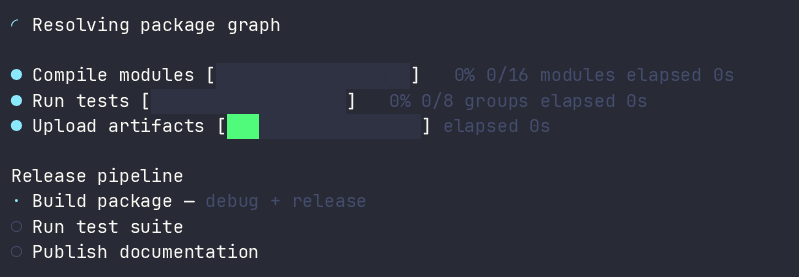
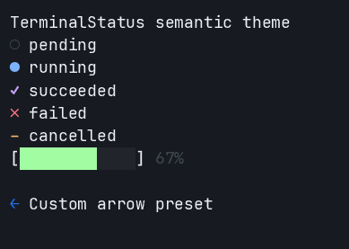

# TerminalStatus

`terminal_status` is a pure-Nim library under active development for terminal
spinners, single and multi-progress bars, and ordered task step-trackers. Its
component renderers are deterministic, terminal-cell aware, and ANSI-safe;
the explicit live layer can redraw an ANSI terminal or coalesce redirected
output without starting a thread or owning terminal input state.

The `0.1.x` line requires Nim 2.2.10 or newer and builds on
`terminal_style >= 0.1.1` and `terminal_screen >= 0.1.1`. The normative design
and API contracts live in [`specs/`](specs/).



[Download the source asciicast](docs/recordings/renderers.cast) or run the
finite [`examples/renderers.nim`](examples/renderers.nim) dashboard locally.

## Pure rendering

All components expose the same side-effect-free `render` shape. Pass one
monotonic timestamp so every animation and metric in a multi-row frame agrees:

```nim
import std/[monotimes, times]
import terminal_status

let started = getMonoTime()
var download = initProgressBar("Download", 100, "MB", started)
download.advance(50, started + initDuration(seconds = 2))

var options = defaultRenderOptions()
options.characters = statusAscii
options.useColor = false
options.barWidth = 10

doAssert download.render(
  options,
  started + initDuration(seconds = 2)
) == "> Download [#####-----]  50% 50/100 MB 25.0 MB/s ETA 2s"
```

`render` is overloaded for `Spinner`, `ProgressBar`, `MultiProgress`, and
`StepTracker`. A positive `width` is a maximum measured in terminal cells;
rows are never padded, wide or combined graphemes are not split, and narrow
progress rows shed elapsed, rate, ETA, and count metadata before shrinking the
bar or label. Multi-row output has no trailing newline.

Caller text is normalized to one safe row. SGR styles and OSC-8 hyperlinks are
preserved and closed when color is enabled; terminal movement, erasure, title,
clipboard, and other executable controls are removed. `useColor = false`
removes both theme and caller ANSI. See the [pure rendering guide](docs/rendering.md)
for metric formats, responsive reduction, and safety details.

## Themes and character presets

Presentation is local and explicit: `StatusTheme` holds semantic
`TerminalStyle` values, `StatusCharacters` selects Unicode or ASCII glyphs,
and `RenderOptions.useColor` determines whether styling is retained. No global
theme is installed and no terminal is queried when defaults are constructed.



[Download the source asciicast](docs/recordings/themes.cast) or run the finite
[`examples/customization.nim`](examples/customization.nim) demo locally.

```nim
import terminal_style
import terminal_status

var options = defaultRenderOptions()
options.characters = statusAscii
options.useColor = false
options.theme.successStyle = initTerminalStyle(
  foreground = colorMagenta,
  attributes = {taBold}
)

doAssert asciiStatusMarkers().succeeded == "+"
doAssert unicodeStatusMarkers().succeeded == "✓"
```

The default semantic colors are cyan for running work, green for success and
completed bars, red for failures, yellow for cancellation, and dim bright
black for pending or secondary content. The disabled TerminalStyle path strips
both theme styling and caller-provided ANSI, so every renderer guarantees plain
output for `useColor = false`.

See the [themes and marker guide](docs/themes.md) and finite
[`customization.nim`](examples/customization.nim) example for the full marker
table, a custom theme and spinner preset, and `--ascii`/`--no-color` previews.

## Spinner

Import the façade, choose a built-in preset, and sample frames whenever your
application refreshes its display:

```nim
import std/[monotimes, strutils, times]
import terminal_status

let started = getMonoTime()
var spinner = initSpinner("Indexing files", arcSpinner(), started)

# Rendering and frame selection are pure; no background timer is started.
let later = started + initDuration(milliseconds = 200)
doAssert spinner.frame(now = later) == "◝"
doAssert spinner.render(now = later).endsWith(" Indexing files")

spinner.setLabel("Index complete")
spinner.succeed(later)
doAssert spinner.state == statusSucceeded
doAssert spinner.elapsed(later).inMilliseconds == 200
```

`dotsSpinner`, `lineSpinner`, `arcSpinner`, and `pulseSpinner` include both
Unicode frames and printable-ASCII fallbacks. Pass `asciiOnly = true` to
`frame` for the fallback. `initSpinnerStyle` validates custom frame widths,
controls, fallback counts, and positive intervals.

Animation is derived from monotonic elapsed time; callers explicitly sample
and refresh it. Terminal transitions freeze elapsed time and frame selection.
Repeating the same success, failure, or cancellation is harmless, while
switching terminal outcomes raises `StatusStateError`. See the
[Spinner model guide](docs/spinners.md) for presets, customization, ownership,
and transition behavior.

## Progress

Determinate progress checks every numeric update before mutation and
automatically succeeds when it reaches the exact total:

```nim
import std/[monotimes, options, times]
import terminal_status

let started = getMonoTime()
var download = initProgressBar("Download", 10, "files", started)

download.advance(4, started + initDuration(seconds = 2))
doAssert download.fraction.get == 0.4
doAssert download.ratePerSecond(
  started + initDuration(seconds = 2)).get == 2.0
doAssert download.eta(
  started + initDuration(seconds = 2)).get.inSeconds == 3

download.complete(started + initDuration(seconds = 5))
echo download.render(now = started + initDuration(seconds = 5))
```

Rates are lifetime averages based on monotonic elapsed time. ETA is available
only for running determinate work with a positive rate and is rounded to the
nearest millisecond. Terminal elapsed time and rate freeze at the first finish
timestamp, and terminal ETA is absent.

`initIndeterminateProgressBar` represents work without a total. Its renderer
derives pulse motion from the stored start timestamp, so it needs no
per-frame model mutation. See the [Progress models guide](docs/progress.md) and
the finite [`progress_bar.nim`](examples/progress_bar.nim) and
[`indeterminate_bar.nim`](examples/indeterminate_bar.nim) examples.

## Multi-progress

`MultiProgress` keeps insertion order and assigns IDs that are never reused:

```nim
var work = initMultiProgress()
let
  compileId = work.addTask("Compile", 12, "modules")
  uploadId = work.addIndeterminateTask("Upload")

work.advance(compileId, 3)
work.complete(uploadId)
doAssert work.taskIds == @[compileId, uploadId]
echo work.render()
```

All mutations by ID reject unknown tasks without changing the collection.
Snapshot queries return detached values and fresh sequence storage. The finite
[`multi_progress.nim`](examples/multi_progress.nim) example demonstrates task
mutation, removal, and non-reused IDs.

## Steps

```nim
var release = initStepTracker(["Build", "Test", "Publish"], "Release")
release.start()
release.setCurrentDetail("release mode")
release.advance()
echo release.render()
```

Advancing succeeds the current step and starts the next; advancing the last
step succeeds the tracker. Failure affects the current step while leaving later
steps pending. Cancellation preserves earlier successful steps. See the
[Step tracker guide](docs/steps.md) and finite
[`step_tracker.nim`](examples/step_tracker.nim) example.

## Shared contracts

Import `terminal_status/types` directly or use the `terminal_status` façade for
the shared API:

```nim
import terminal_status

let taskId = TaskId(42)
doAssert $taskId == "42"
doAssert statusSucceeded.isTerminal
```

The shared module includes lifecycle and progress states, catchable model
errors, task IDs, detached progress/step snapshots, meaningful-text and numeric
validation, finite terminal transitions, and clamped monotonic-duration
helpers. See [Shared contracts](docs/shared-contracts.md) for behavior and
ownership details. The finite [`shared_types.nim`](examples/shared_types.nim)
and [`validation.nim`](examples/validation.nim) examples show those contracts
and their failure handling as runnable programs.

## Live output strategies

`LiveDisplay` borrows `stderr` by default. Auto mode performs one TerminalScreen
capability check when the display opens: ANSI-capable output uses redraws, while
a file or pipe uses plain output. Construction and import remain side-effect
free.

```nim
import terminal_status

var options = defaultLiveDisplayOptions() # borrowed stderr
withLiveDisplay display, options:
  display.update("Downloading\n25% complete")
  display.update("Download complete\n100% complete")
```

In ANSI mode a changed frame clears exactly the rows previously owned by the
display before drawing its replacement, so narrower or shorter frames leave no
stale text and unrelated terminal output is not erased. `finishKeep` moves
subsequent output below the retained frame; set `finishPolicy = finishClear` to
erase the region on close. Cursor hiding is opt-in and ownership-aware:
`hideCursor = true` restores visibility exactly once during cleanup.

Redirected output defaults to `plainFinalOnly`, so the example emits only the
latest frame when it closes instead of logging every animation tick. Set
`mode = livePlain` and `plainPolicy = plainEveryChange` to write every changed
visible frame; duplicate frames and color-only changes are suppressed. Plain
output always strips ANSI.

Displays are single-use and single-thread owned. They never close the borrowed
stream, enter raw input mode, query terminal geometry, or create a refresh
loop. Updates and close flush only at the configured points, while duplicate
frames perform neither operation. Prefer `withLiveDisplay`, whose `finally`
cleanup covers normal return and catchable Nim exceptions (not signals,
process termination, defects, or `SIGKILL`). See the
[live output guide](docs/live-output.md) and finite
[`live_output.nim`](examples/live_output.nim) example.

## Modules

| Module | Available responsibility |
| --- | --- |
| `terminal_status` | Side-effect-free façade exporting implemented public modules. |
| `terminal_status/types` | Shared states, errors, IDs, snapshots, validation, transitions, and time helpers. |
| `terminal_status/spinners` | Validated presets and pure, time-derived spinner state. |
| `terminal_status/progress` | Determinate/indeterminate progress metrics and ordered multi-progress tasks. |
| `terminal_status/steps` | Ordered step state, details, failure, and cancellation. |
| `terminal_status/themes` | Semantic TerminalStyle values and Unicode/ASCII marker presets. |
| `terminal_status/rendering` | Pure component renderers, metrics, text safety, and responsive cell widths. |
| `terminal_status/live` | Auto/forced ANSI or plain output with coalesced redirected frames. |

TerminalStatus uses TerminalStyle for ANSI-aware validation and terminal-cell
measurement. The live module uses TerminalScreen for deferred capability
detection and cursor commands, but never opens a raw-mode session. Library
model and rendering modules never query or write to a terminal.

## Development

Compiler products, caches, test executables, and generated documentation must
remain under `build/`. Hand-written source, tests, examples, and documentation
remain in their normal repository directories.

```sh
nimble check
nim c --path:src src/terminal_status.nim
nimble test
nimble c -r examples/shared_types.nim
nimble c -r examples/validation.nim
nimble c -r examples/spinner.nim
nimble c -r examples/progress_bar.nim
nimble c -r examples/indeterminate_bar.nim
nimble c -r examples/multi_progress.nim
nimble c -r examples/step_tracker.nim
nimble c -r examples/renderers.nim -- --once
nimble c -r examples/customization.nim -- --once
nimble c -r examples/live_output.nim
nimble docs
```

The documentation task writes generated API documentation and indexes to
`build/docs/`; it does not create the conventional `htmldocs/` directory.
